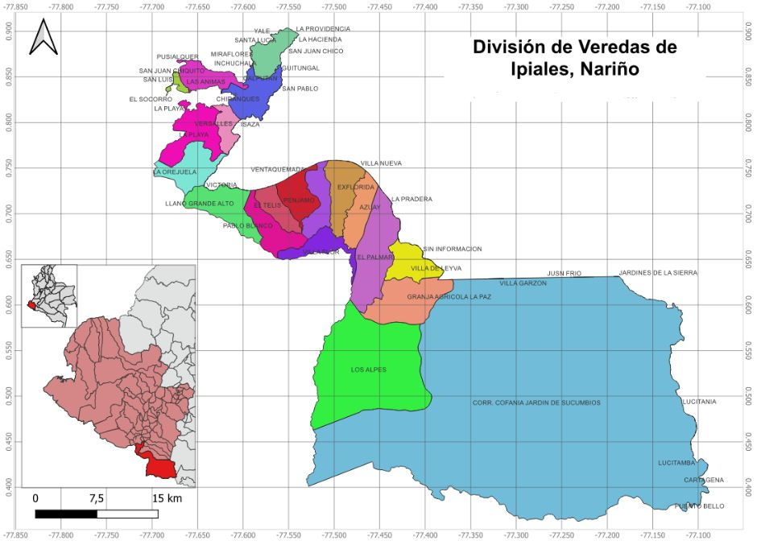

# Introducción

El cultivo de gulupa (*Passiflora edulis* Sims) representa una oportunidad comercial a nivel nacional e internacional, consolidándose como producto de alto potencial de exportación en los últimos años (Escobar Quiñónez et al., 2024). Actualmente, es el quinto fruto más exportado en el país, siendo Colombia el principal proveedor de este producto hacia la Unión Europea (Cáceres, 2026). La mayoría de las zonas productoras se han establecido en las últimas dos décadas en diferentes departamentos, entre los que destacan Antioquia, Cundinamarca, Boyacá y Huila, reconocidos por su producción de frutas con calidad de exportación gracias a sus condiciones agroecológicas favorables (De Armas Costa et al., 2023). 

En este contexto, debido a la creciente demanda de este fruto en el mercado internacional, la industria agrícola ha identificado la necesidad de expandir el área cultivada de gulupa en el país (Cuspoca-Chaparro et al., 2023), algunos departamentos presentan alto potencial para la producción, como Nariño, en donde se han registrado plantaciones con fines de exportación (ICA, 2019) y podrían destinarse áreas a la producción en diferentes municipios como es el caso de Ipiales, que cuenta con altitudes mayores a 2.800 m.s.n.m, temperaturas entre 6 °C y 14 °C y condiciones de montaña, en general favorables para el desarrollo del cultivo (Ocampo y Wyckhuys, 2012).

Sin embargo, al ser un cultivo semipermanente que implica alta inversión inicial (Ocampo y Wyckhuys, 2012), determinar zonas adecuadas para las plantaciones de gulupa es un reto importante. Por esto, es necesario realizar análisis integrales para el establecimiento del cultivo que consideren variables espaciales, climáticas, edáficas, topográficas y sociales, con el fin de apoyar la toma de decisiones informadas.

Para esto, el uso de las herramientas de geomática, como los Sistemas de Información Geográfica (SIG), resulta esencial para la planificación territorial de sistemas productivos agrícolas, ya que permite integrar, procesar y analizar múltiples variables espaciales facilitando la evaluación de la aptitud del territorio a diferentes escalas espaciales y temporales (Saraiva et al., 2025; Balbontín et al., 2016; Ceballos-Silva y López-Blanco 2010). De esta manera, se puede generar información precisa que respalde la toma de decisiones, reduciendo la incertidumbre del productor, aumentando la probabilidad de desarrollar proyectos productivos rentables y promoviendo sistemas sostenibles que hagan un uso eficiente de los recursos naturales.

# Objetivos

Evaluar la aptitud territorial para el establecimiento de un sistema productivo de gulupa en el municipio de Ipiales, mediante el uso de Sistemas de Información Geográfica (SIG) y técnicas de análisis multicriterio, con el fin de identificar zonas óptimas que soporten la planificación y toma de decisiones productivas.

- Analizar y procesar variables biofísicas y de accesibilidad mediante herramientas SIG, con el fin de generar mapas temáticos que caracterizan las condiciones del área de estudio.
- Integrar las variables seleccionadas a través de un modelo de análisis multicriterio espacial, aplicando procesos de normalización y ponderación, para delimitar zonas con diferentes niveles de aptitud para el cultivo de gulupa.

# Estado del Arte

Existen diferentes enfoques en la delimitación de áreas adecuadas para establecer sistemas productivos. En la actualidad, diversos estudios han demostrado que los SIG son herramientas clave en la planificación del área agrícola, el monitoreo de cultivos y el manejo agronómico con precisión geográfica (Bermeo Almeida  et al., 2025), ya que se caracterizan por su capacidad de almacenar grandes cantidades de información geo-referenciada y su potencial de análisis para responder a problemas de planificación y gestión (Pineda y Suárez, 2014).

Esta herramienta se ha aplicado para realizar zonificaciones agroecológicas incluyendo criterios de geomorfología, climatología y requerimientos edafoclimáticos, generando un sistema dinámico de consulta de atributos para identificar zonas óptimas para el desarrollo del cultivo de café (Pineda y Suárez, 2014). Según León Duran et al. (2018), el análisis integral con SIG permitió la representación de distribución espacial y la determinación de aptitud para el cultivo de papaya. 

Para el monitoreo cacao, se han integrado herramientas SIG junto a índices espectrales para evaluar el estado y la gestión efectiva del manejo agronómico, así como la reforestación basada en el área de cobertura vegetal (Bermeo Almeida  et al., 2025), además, el uso de SIG permitió la clasificación en áreas y permitió mejorar el manejo del suelo, como parte de la determinación de aptitud para este cultivo (Centeno, 2020). 

# Área de estudio 

El área de estudio corresponde al municipio de Ipiales, ubicado en el departamento de Nariño, al sur de Colombia, esta zona presenta condiciones agroecológicas potencialmente favorables para el cultivo de gulupa, especialmente en términos de altitud, temperatura y régimen de precipitaciones.

# Fuentes de Datos

Para la elaboración del análisis, se requiere recopilar diversa información geoespacial de las variables que influyen en la aptitud territorial y determinar zonas aptas para el establecimiento de un cultivo de gulupa en el área de estudio. Se utilizarán plataformas institucionales, catálogos geográficos y herramientas de datos espaciales para obtener las variables necesarias del análisis. 

Para la caracterización de los criterios físicos, como las variables climáticas, que incluyen precipitación, temperatura (mínima, máxima y media), radiación solar, humedad relativa, velocidad del viento y evapotranspiración, se hará uso de bases de datos climáticos de acceso abierto como WorldClim y nacionales como el Instituto de Hidrología, Meteorología y Estudios Ambientales (IDEAM), así como plataformas de análisis geoespacial como Google Earth Engine. Adicionalmente, se integrarán registros provenientes de estaciones meteorológicas cercanas al área de estudio para mayor precisión y representatividad. 

Para la oferta edafológica se considerarán variables como tipo de suelo, textura, profundidad efectiva, geomorfología, uso actual del suelo, pendiente, drenaje y fertilidad. Esta información será obtenida de los catálogos y bases de datos del Instituto Geográfico Agustín Codazzi (IGAC). Para el análisis de accesibilidad, se utilizarán capas de información vial e infraestructura de plataformas de acceso abierto como OpenStreetMap con el fin de evaluar la conectividad del territorio y su relación con las áreas potenciales. 

# Metodología Propuesta

La metodología propuesta para el proyecto se adecuó según lo planteado por Ceballos-Silva y López-Blanco (2010).

Este proyecto se va a desarrollar bajo un enfoque de análisis espacial aplicado, mediante el uso de SIG y técnicas de evaluación multicriterio, con el propósito de determinar la aptitud territorial para el establecimiento de un sistema productivo de gulupa; la metodología integra variables biofísicas y socio espaciales, procesadas tanto en entorno SIG como mediante herramientas de análisis programático.

El procesamiento inicial de la información se realizó en el software QGIS, donde se plantean actividades como la unificación del sistema de referencia espacial, el recorte de todas las capas al límite del área de estudio, la conversión de formatos vectoriales y raster según los requerimientos del análisis y la generación de variables derivadas, particularmente la pendiente, obtenida a partir del modelo digital de elevación mediante herramientas de análisis de terreno.

Con el fin de integrar variables ambientales con diferentes unidades y escalas dentro del análisis multicriterio, se realizará un proceso de normalización de los datos, el cual permite transformar los valores originales a una escala adimensional común, generalmente entre 0 y 1, facilitando su comparación y posterior combinación.

La necesidad de este proceso radica en que variables como altitud, precipitación, temperatura y pendiente presentan rangos de valores distintos, lo que podría generar sesgos en el análisis si se integran directamente, en ausencia de normalización, las variables con mayores magnitudes numéricas tendrían una influencia desproporcionada en los resultados finales.

Se implementará un método de ponderación basado en la importancia relativa de cada variable en el desarrollo del cultivo; para ello, se utilizó un enfoque de análisis jerárquico (AHP), mediante el cual se asignaron pesos a cada variable en función de su influencia agronómica, las variables relacionadas con condiciones climáticas y altitudinales recibieron mayor ponderación, dado su impacto directo en el crecimiento y productividad del cultivo.

El análisis se implementará mediante un modelo de combinación lineal ponderada, en el cual cada variable normalizada se multiplica por su respectivo peso y posteriormente se suman los resultados, generando un índice de aptitud territorial. Este índice permite identificar espacialmente las zonas con mayor potencial para el establecimiento del cultivo de gulupa. 
Se evaluará la accesibilidad del área mediante la generación de zonas de influencia (buffers) alrededor de la red vial, determinadas a partir de la intersección de áreas con alta aptitud agroecológica y condiciones favorables de accesibilidad, permitiendo delimitar espacialmente las áreas con mayor potencial productivo dentro del municipio, y comparados con información secundaria sobre el uso actual del suelo y las condiciones productivas de la región.

# Referencias

Bermeo Almeida, O. X., Dávila Vargas, W. J., & Guevara Arias, V. Isabel. (2025). Aplicación de SIG en análisis de NDVI para cultivos de cacao con precisión geográfica. Alfa Revista de Investigación en Ciencias Agronómicas y Veterinaria, 9(26), 331-349. Epub 05 de mayo de 2025.https://doi.org/10.33996/revistaalfa.v9i26.350

Cáceres, J. L. (2026). Determinación de los requerimientos nutricionales de las plantas de gulupa (Passiflora edulis Sims) cultivadas bajo condiciones de cubierta en la Sabana de Bogotá. Recuperado de: https://repositorio.unal.edu.co/handle/unal/89572

Ceballos-Silva, A. P., & López-Blanco, J. (2010). Delimitación de áreas adecuadas para cultivos de alternativa: una evaluación multicriterio-SIG. Terra Latinoamericana, 28(2), 109-118. Recuperado en 01 de abril de 2026, de http://www.scielo.org.mx/scielo.php?script=sci_arttext&pid=S0187-57792010000200002&lng=es&tlng=es.

Centeno, V. A. (2020). Utilización de herramientas SIG para el manejo eficiente y sostenible del cultivo de cacao (Theobroma cacao L.) en la finca agrícola Bellavista Cantón Chontamarca. Universidad Agraria del Ecuador. 

Cuspoca-Chaparro, E. D., Melo-Torres, L. I., & Mesa-Mojica, J. I. (2024). Propuesta de una red de gestión del conocimiento para la industria de la gulupa en Colombia. Respuestas, 29(1), 67–83. https://doi.org/10.22463/0122820X.4165

De Armas Costa, R. J., Martín Gómez, P. F., & Rangel Díaz, J. E. (2022). Gulupa (Passiflora edulis Sims), su potencial para exportación, su matriz y su firma de maduración: una revisión. Ciencia y Agricultura, 19(1), 15–27. https://doi.org/10.19053/01228420.v19.n1.2022.13822

Escobar Quiñónez, E. E., Collazos Restrepo, A., & García Molina, G. (2024). Tendencias para la internacionalización y tecnificación de la gulupa en Colombia: Una revisión bibliométrica con Bibliometrix. Revista Científica Profundidad Construyendo Futuro, 21(21), 50–61. https://doi.org/10.22463/24221783.4369 

Instituto Colombiano Agropecuario (ICA). (2019, marzo 6). Productores de gulupa nariñense recibieron el registro para la exportación en fresco. https://www.ica.gov.co/noticias/ica-registro-exportacion-fresco-productores-gulupa

León Durán, R., Combatt Castillo, E. M., Villalba Arteaga, J. V., Polo Santos, J. M., & Valencia Agressoth, R. S. (2018). Zonificación edafoclimática para el cultivo de la papaya en Valencia, Córdoba (Colombia). Temas Agrarios, 23(2), 164–176. https://doi.org/10.21897/rta.v23i2.1300

Saraiva, D. G., Ferreira, A. L., Fajoli, L. P., & Barbosa, B. M. (2025). Uso de sistemas de informação geográfica (SIG) na agricultura. Observatorio de la Economía Latinoamericana, 23(4), e9642. https://doi.org/10.55905/oelv23n4-134

Pineda, L. D., y Suárez J. E. (2014) "Elaboración de un SIG orientado a la zonificación agroecológica de los cultivos." Revista Ingeniería Agrícola, vol. 4, no. 3, pp.28-32. Redalyc,  https://www.redalyc.org/articulo.oa?id=586262041005

Ocampo, J. & Wyckhuys, K. (2012). Editores. Tecnología para el cultivo de la gulupa (Passiflora edulis f. edulis Sims) en Colombia. Centro de Bio-Sistemas de la Universidad Jorge Tadeo Lozano, Centro Internacional de Agricultura Tropical - CIAT y Ministerio de Agricultura y Desarrollo Rural, República de Colombia. Bogotá, 68 páginas
