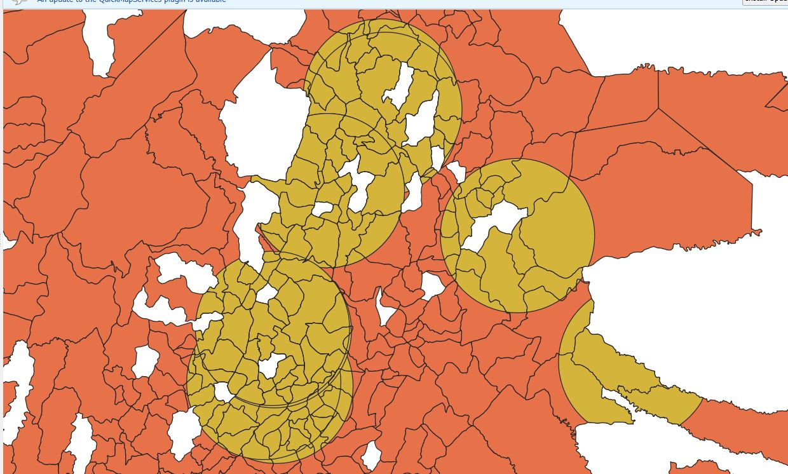

<<<<<<< HEAD
---
title: "Taller de Conversion de Formatos"
author: "Wilder Clavijo"
format:
  html:
    toc: true
    number-sections: true

  pdf:
    toc: true
    number-sections: true
    
    geometry: margin=2cm
---

# Pregunta 1: Por qué es un error intentar abrir un KML con coordenadas planas (metros) en Google Earth?

Intentar abrir un archivo KML en metros dentro de Google Earth constituye un error porque este formato está diseñado para trabajar exclusivamente con coordenadas geográficas en el sistema de referencia WGS84, expresadas en latitud y longitud (grados); cuando un archivo contiene coordenadas proyectadas en metros, como las utilizadas en sistemas proyectados tipo UTM o MAGNA-SIRGAS, el visor no puede interpretarlas correctamente porque espera valores angulares y no distancias lineales.

Por esta razón se dice que no existe “proyección al vuelo” en google earth. 
Software SIG como QGIS o ArcGIS pueden mostrar simultáneamente capas en diferentes sistemas de coordenadas porque realizan estas transformaciones automáticamente. En cambio, Google Earth requiere que los datos ya se encuentren en el sistema geográfico WGS84, por lo que no realiza conversiones automáticas entre sistemas proyectados y geográficos.

# Pregunta 2: ¿Es más eficiente realizar primero el filtro por nombre (Atributos) o el filtro por radio de 40 km (Espacial)?

Para el proceso de filtrado descrito, resulta más eficiente realizar primero el filtro por atributos (por nombre) y posteriormente aplicar el filtro espacial mediante el buffer de 40 km. La razón principal es que el filtrado por atributos reduce inicialmente la cantidad de registros que deben procesarse en las operaciones espaciales posteriores.

Las operaciones espaciales como la generación de buffers o las intersecciones requieren cálculos geométricos que consumen más memoria y capacidad de procesamiento que los filtros de atributos, los cuales consisten únicamente en comparaciones de valores dentro de una tabla. Si primero se reduce el número de entidades mediante un filtro por atributos, el algoritmo espacial se ejecutará sobre un conjunto de datos más pequeño, lo que disminuye el uso de memoria y mejora la eficiencia computacional.

Desde la perspectiva de un proceso ETL (Extract, Transform, Load), esta estrategia permite optimizar el flujo de transformación de datos, ya que se evita aplicar operaciones geométricas costosas sobre información que posteriormente sería descartada.

## Resultado del buffer posterior al filtro de atributos

 

# Reflexion

Durante la carga de datos hacia una base de datos espacial se observó que existen restricciones de compatibilidad entre diferentes plataformas SIG, en particular, ArcGIS presenta limitaciones en el manejo de algunos nombres de esquemas o configuraciones dentro de bases de datos PostgreSQL/PostGIS, lo que puede dificultar la importación directa de capas espaciales.

En este contexto, QGIS funciona como una herramienta de interoperabilidad o “puente” entre distintos sistemas geoespaciales, ya que posee soporte nativo para múltiples formatos de datos vectoriales y ráster, así como conectores directos con bases de datos espaciales como PostGIS. Esto permite importar, transformar y exportar información geográfica de manera flexible, adaptando estructuras de datos, nombres de campos o esquemas según los requerimientos del sistema destino, facilitando los procesos ETL en entornos geomáticos permitiendo que datos provenientes de diferentes plataformas y formatos puedan almacenarse y gestionarse eficientemente.

## Tabla de atributos despues del filtro por atributos

[Tabla de atributos](TablainterseccionT3.JPG)
=======
---
title: "Taller de Conversion de Formatos"
author: "Wilder Clavijo"
format:
  html:
    toc: true
    number-sections: true

  pdf:
    toc: true
    number-sections: true
    
    geometry: margin=2cm
---

# Pregunta 1: Por qué es un error intentar abrir un KML con coordenadas planas (metros) en Google Earth?

Intentar abrir un archivo KML en metros dentro de Google Earth constituye un error porque este formato está diseñado para trabajar exclusivamente con coordenadas geográficas en el sistema de referencia WGS84, expresadas en latitud y longitud (grados); cuando un archivo contiene coordenadas proyectadas en metros, como las utilizadas en sistemas proyectados tipo UTM o MAGNA-SIRGAS, el visor no puede interpretarlas correctamente porque espera valores angulares y no distancias lineales.

Por esta razón se dice que no existe “proyección al vuelo” en google earth. 
Software SIG como QGIS o ArcGIS pueden mostrar simultáneamente capas en diferentes sistemas de coordenadas porque realizan estas transformaciones automáticamente. En cambio, Google Earth requiere que los datos ya se encuentren en el sistema geográfico WGS84, por lo que no realiza conversiones automáticas entre sistemas proyectados y geográficos.

# Pregunta 2: ¿Es más eficiente realizar primero el filtro por nombre (Atributos) o el filtro por radio de 40 km (Espacial)?

Para el proceso de filtrado descrito, resulta más eficiente realizar primero el filtro por atributos (por nombre) y posteriormente aplicar el filtro espacial mediante el buffer de 40 km. La razón principal es que el filtrado por atributos reduce inicialmente la cantidad de registros que deben procesarse en las operaciones espaciales posteriores.

Las operaciones espaciales como la generación de buffers o las intersecciones requieren cálculos geométricos que consumen más memoria y capacidad de procesamiento que los filtros de atributos, los cuales consisten únicamente en comparaciones de valores dentro de una tabla. Si primero se reduce el número de entidades mediante un filtro por atributos, el algoritmo espacial se ejecutará sobre un conjunto de datos más pequeño, lo que disminuye el uso de memoria y mejora la eficiencia computacional.

Desde la perspectiva de un proceso ETL (Extract, Transform, Load), esta estrategia permite optimizar el flujo de transformación de datos, ya que se evita aplicar operaciones geométricas costosas sobre información que posteriormente sería descartada.

# Reflexion

Durante la carga de datos hacia una base de datos espacial se observó que existen restricciones de compatibilidad entre diferentes plataformas SIG, en particular, ArcGIS presenta limitaciones en el manejo de algunos nombres de esquemas o configuraciones dentro de bases de datos PostgreSQL/PostGIS, lo que puede dificultar la importación directa de capas espaciales.

En este contexto, QGIS funciona como una herramienta de interoperabilidad o “puente” entre distintos sistemas geoespaciales, ya que posee soporte nativo para múltiples formatos de datos vectoriales y ráster, así como conectores directos con bases de datos espaciales como PostGIS. Esto permite importar, transformar y exportar información geográfica de manera flexible, adaptando estructuras de datos, nombres de campos o esquemas según los requerimientos del sistema destino, facilitando los procesos ETL en entornos geomáticos permitiendo que datos provenientes de diferentes plataformas y formatos puedan almacenarse y gestionarse eficientemente.
>>>>>>> origin/master
